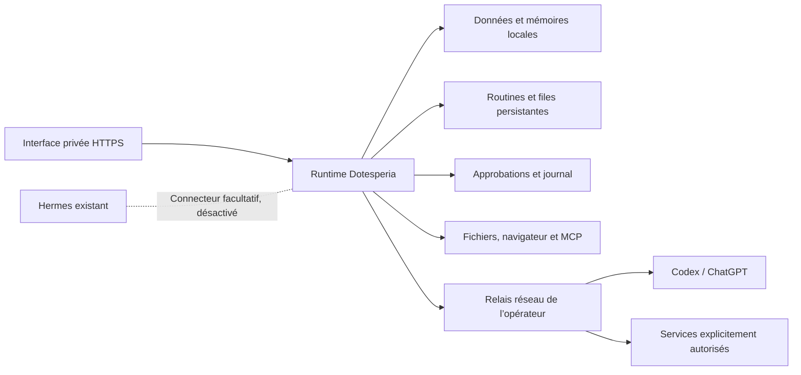

# Dotesperia : architecture privée

Le fork conserve le runtime persistant d’OpenMausBot et utilise Codex/ChatGPT
pour l’inférence. Les conversations, pièces jointes, mémoires, décisions et
routines restent sur le serveur de l’opérateur. Le contexte envoyé au modèle
cloud constitue une exception explicite : cette configuration ne signifie pas
que l’inférence est locale.

## Frontières

* Le compte `dotesperia` possède uniquement ses données, sessions Codex et
  espaces de travail. Il n’est membre d’aucun groupe donnant accès à sudo,
  Docker ou aux données des autres agents.
* Le code et les unités appartiennent à l’opérateur non-root. Le runtime ne
  peut pas modifier son code, ses règles réseau ou le relais, exécuté sous
  `dotesperia-net`. Les privilèges d’administration servent uniquement à
  installer les comptes, unités et règles réseau.
* Le pare-feu filtre seulement l’UID du nouvel agent, pour IPv4 et IPv6.
  Le trafic des autres services reste inchangé. Le relais autorise les noms
  explicites et vérifie le nom TLS avant de transmettre la connexion.
* La télémétrie PostHog a été supprimée. La télémétrie, les métriques et le
  retour d’information Codex sont désactivés. Les mises à jour et installations
  automatiques, Composio, les comptes/sauvegardes hébergés et les ordinateurs
  du fournisseur sont refusés. Les anciens lanceurs Electron, CLI et compagnon
  sont désactivés ; l’interface Apps propose uniquement les connexions MCP.
* Le serveur refuse les transports HTTP/WS/JS non autorisés. La politique CSP
  empêche aussi l’interface de charger des ressources externes. Le pare-feu est
  nécessaire : un garde JavaScript ne contrôle pas les programmes natifs.

## Fonctions conservées

La base apporte déjà les fils persistants, tâches/objectifs, routines et leurs
journaux, mémoires structurées (sujets, entrées, rappel, capture et entretien),
approbations, sélection d’outils et connexions MCP. Les notifications et les
écrans de suivi servent de point de départ, sans créer un second ordonnanceur.

Après redémarrage, les routines dues et files admissibles sont reconciliées.
Une action interrompue n’est pas automatiquement rejouée : elle peut déjà
avoir produit son effet. Son résultat doit être inspecté avant une reprise.
Les tests de démarrage vérifient précisément cette distinction.

Le fonctionnement 24/7 repose sur les services de la VM et son démarrage
automatique sur l’hyperviseur. Le PC n’est qu’un client de l’interface.
Un déclencheur lance un travail ; un agent inactif ne consomme pas le modèle
en boucle. Les premiers travaux planifiés restent soumis aux approbations.

Le suivi [Objectifs et proactivité](proactivity.md) ajoute les responsabilités
persistantes et leurs réveils au-dessus de cette même file. Il attend une
échéance, un changement dans le workspace autorisé ou un événement privé.
Le bot enregistre un résultat et une suite explicite ; les limites quotidiennes
et les cas demandant une décision sont visibles dans l'interface.

## Hermes reste indépendant

Aucun fichier, plugin, profil, service ou identifiant de Hermes n’est utilisé
par le déploiement. Aucun montage de son disque ni copie de son authentification
n’est nécessaire. La connexion Codex utilise le même compte humain mais une
nouvelle session, stockée uniquement dans Dotesperia.

Une future délégation pourra utiliser un MCP appartenant à l’opérateur et
l’interface déjà disponible de Hermes. Elle restera désactivée par défaut,
avec un périmètre et des permissions propres. Installer un driver Hermes
dans le fork est refusé, pour éviter de démarrer ou reconfigurer l’installation
existante par accident. L’arrêt de Dotesperia n’exige aucune réparation de Hermes.

## Évolution et limites

1. Valider le service privé, l’authentification Codex, les refus réseau et la
   reprise après redémarrage du service sur des données de test.
2. Activer le navigateur local et les MCP de l’opérateur, avec des permissions
   précises. La consultation du Web public demande une extension explicite
   de la politique ; elle est refusée par défaut.
3. Ajouter les sources d’événements de l’opérateur, des budgets de tâches et
   des points de reprise montrant l’effet réellement observé.
4. Simplifier le suivi quotidien des tâches/mémoires/approbations et ajouter,
   si souhaité, le connecteur Hermes séparé.

Ce socle ne reproduit pas les mécanismes propriétaires d’OpenAI. L’échange
avec le vrai compte, la qualité de la mémoire, les sites visités et le bureau
graphique complet doivent être vérifiés séparément. Du code de compatibilité
hérité subsiste derrière des capacités refusées : une suppression physique
complète de ces modules est un chantier distinct du contrôle des sorties.

## Vérification

Suivre `docs/verification/README.md` : toujours utiliser une fixture avec un
home et des données jetables, jamais l’application ou les données de l’utilisateur.

`pnpm privacy:test` vérifie : absence de collecte, refus avant transmission,
ports/origines exacts, redirects, sessions Codex distinctes, routes désactivées,
un échange Codex fictif et le refus de tunnels au nom TLS différent.
Les tests `server/routines-startup.test.ts` et `server/memory-entries.test.ts`
vérifient la reprise des routines et la persistance des entrées.

Sur la VM, vérifier aussi sous l’UID de l’agent qu’une connexion directe sortante
est refusée et qu’un tunnel non autorisé reçoit 403. L’interface doit demander
une session lorsqu’elle est atteinte via le relais HTTPS. Un service « active »
seul ne prouve ni le modèle, ni le navigateur, ni une récupération après reboot.
